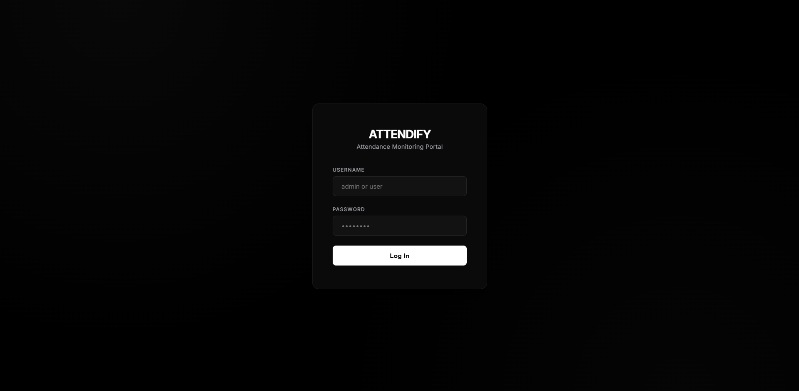
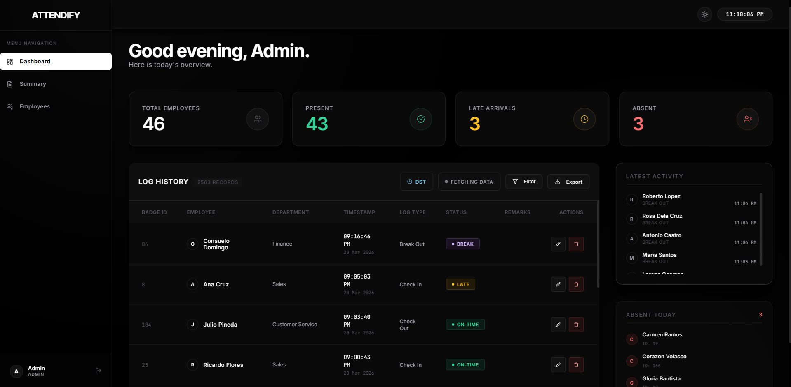
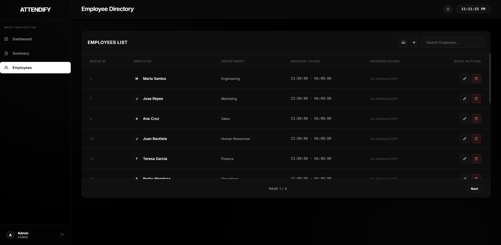
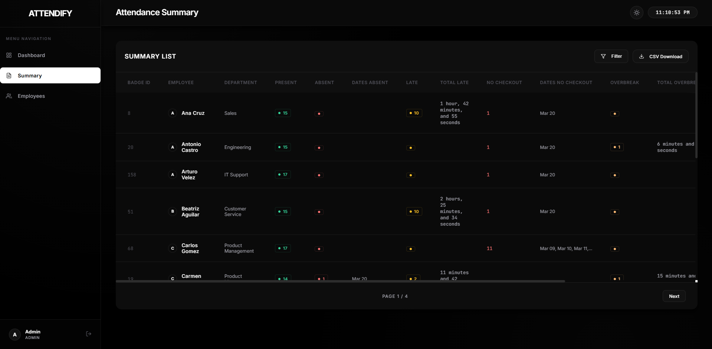
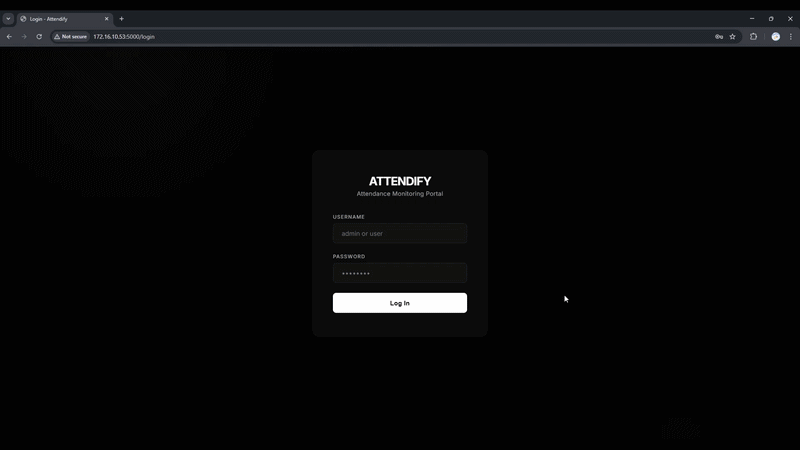

# Attendify: Attendance Monitoring Portal

**Attendify** is a Flask-based responsive web application designed to interface with legacy Microsoft Access biometric databases (`.mdb`). It provides a dark-themed UI for real-time monitoring, employee management, and attendance reporting.

Note: This project is provided strictly as a foundational template. The default UI might suck depending on your specific needs or tastes, but because it relies entirely on utility classes, it is highly customizable. Feel free to rip the Tailwind apart and make it your own!
---

## Interface Preview

| Login Page | Dashboard Overview |
| :---: | :---: |
|  |  |

| Employee Management | Attendance Summary |
| :---: | :---: |
|  |  |

<p align="center">
  
</p>

---
## Key Features

* **Real-time Dashboard:** Track live check-ins, late arrivals, and absent personnel at a glance.
* **Legacy DB Integration:** Direct connection to biometrics using `pyodbc`.
* **Dynamic Shift Logic:** Supports custom weekday and weekend schedules, with automatic late and undertime detection.
* **DST (Daylight Savings) Management:** Granular control over temporal shifts on a per-department basis.
* **Admin Override System:** Manually edit or delete log entries to correct biometric errors.
* **Comprehensive Reporting:** Export filtered attendance logs and summaries directly to CSV.
* **Modern UI:** Glassmorphism design with Dark/Light mode support and AJAX pagination.

---

## Tech Stack

* **Backend:** Python / Flask
* **Database:** Microsoft Access (`pyodbc`) / JSON (for configurations)
* **Frontend:** HTML5, CSS3 (Glassmorphism), Vanilla JavaScript
* **Authentication:** Session-based RBAC (Admin/User roles)

---

## Prerequisites

1.  **Python 3.8+**
2.  **Microsoft Access Database Engine:** Required for `pyodbc` to read `.mdb` files.
3.  **ODBC Driver:** Ensure `Microsoft Access Driver (*.mdb)` is installed on the host machine.

---

## Installation & Setup

1.  **Clone the repository:**
    ```bash
    git clone https://github.com/li0ly0/Attendify.git
    cd attendify
    ```

2.  **Install dependencies:**
    ```bash
    pip install flask pyodbc
    ```

3.  **Configure Database Path:**
    Open `app.py` and update the `DB_PATH` variable to point to your live biometric database:
    ```python
    DB_PATH = r"C:\path\to\your\att2000_live.mdb"
    ```

4.  **Security Setup:**
    Update the `app.secret_key` and default passwords in the `USERS` dictionary before deployment.

5.  **Run the application:**
    ```bash
    python app.py
    ```
    The portal will be available at `http://localhost:5000`.


